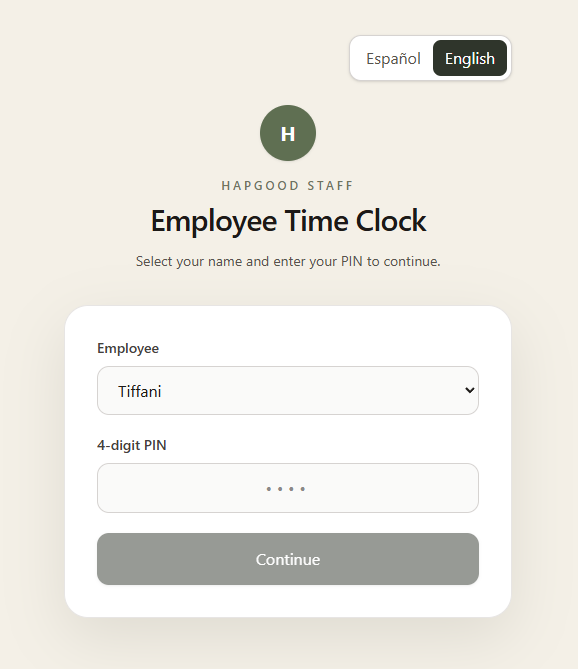
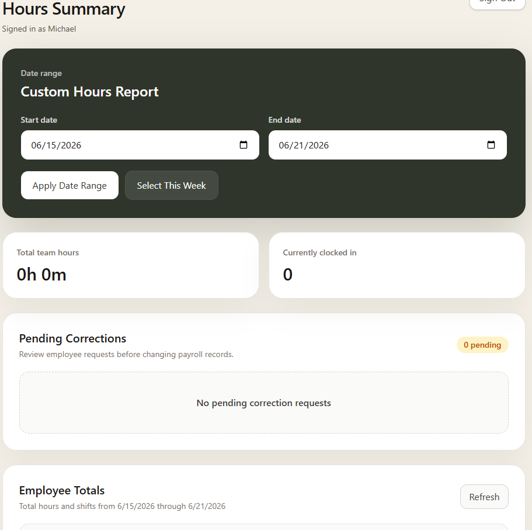
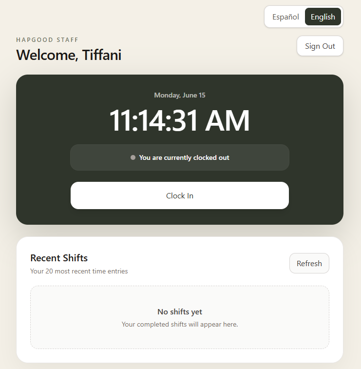

# Hapgood Clock

A browser-based employee time clock built for a small restaurant team.

Employees can clock in and out, review recent shifts, submit correction requests, and report missed shifts. Managers can review team hours, approve or reject employee requests, inspect individual shift details, and generate reports for custom date ranges.

## Live App

https://hapgood-clock.netlify.app

Employee time clock:

https://hapgood-clock.netlify.app/

Manager dashboard:

https://hapgood-clock.netlify.app/manager

The manager route is intentionally separate from the employee interface.

## Features

### Employee Experience

- Secure 4-digit PIN login
- Employee-only login list
- Clock in and clock out from any browser
- Live date and time display
- Recent shift history
- Shift duration calculations
- Submit correction requests for completed shifts
- Submit missed shift requests when a shift was not clocked at all
- View request status as pending, approved, or rejected
- Spanish-first employee interface
- English and Spanish language toggle
- Language preference saved in the browser
- Responsive design for phones, tablets, and desktop

### Manager Experience

- Separate hidden manager route at `/manager`
- Manager login is separate from the employee dropdown
- English-only manager interface
- Manager account cannot clock in or out
- View total team hours
- View totals for each employee
- See who is currently clocked in
- Select a custom report date range
- Quick-select the current week
- Review pending correction requests
- Review pending missed shift requests
- Compare original and requested shift times for corrections
- Approve or reject employee requests
- Add an optional manager note
- Approved corrections automatically update existing shifts
- Approved missed shift requests automatically create new time entries
- Expand employee total cards to view the exact shifts included in the selected date range
- See shift-level details such as clock-in time, clock-out time, duration, active status, and edited status

## Tech Stack

- React
- Vite
- Tailwind CSS
- Supabase
- PostgreSQL
- JavaScript

## Project Structure

- `public/`
  - `_redirects`
- `src/`
  - `App.jsx`
  - `index.css`
  - `main.jsx`
  - `supabaseClient.js`
- `.env.example`
- `.gitignore`
- `index.html`
- `package.json`
- `package-lock.json`
- `vite.config.js`
- `README.md`

## Getting Started

### Prerequisites

Install:

- Node.js 20.19 or newer
- npm
- A Supabase account

### Clone the Repository

Run:

    git clone https://github.com/robregan/hapgood-clock.git
    cd hapgood-clock

### Install Dependencies

Run:

    npm install

### Configure Environment Variables

Copy the example file:

    cp .env.example .env.local

Add your Supabase project values to `.env.local`:

    VITE_SUPABASE_URL=your_supabase_project_url
    VITE_SUPABASE_PUBLISHABLE_KEY=your_supabase_publishable_key

Do not commit `.env.local`.

Never expose a Supabase service-role key in the frontend.

### Netlify Route Handling

The app uses a separate manager route at `/manager`.

The `public/_redirects` file is required so Netlify can serve the React app when someone visits or refreshes `/manager`.

The file should contain:

    /* /index.html 200

### Run Locally

Run:

    npm run dev

Vite will display a local address, usually:

    http://localhost:5173

Employee route:

    http://localhost:5173/

Manager route:

    http://localhost:5173/manager

## Available Scripts

Development server:

    npm run dev

Production build:

    npm run build

Preview the production build:

    npm run preview

Run the linter:

    npm run lint

## Database Overview

### `employees`

Stores employee and manager accounts.

Important fields:

- `id`
- `name`
- `pin_hash`
- `role`
- `can_clock`
- `active`
- `created_at`

PINs are stored as hashes and are never saved as readable text.

Employees have `can_clock = true`.

The manager has `role = 'manager'` and `can_clock = false`.

### `time_entries`

Stores clock-in and clock-out records.

Important fields:

- `id`
- `employee_id`
- `employee_name`
- `clock_in`
- `clock_out`
- `created_at`
- `edited_at`
- `edited_by`
- `edit_reason`

A partial unique index prevents an employee from having more than one open shift.

Approved correction requests update existing time entries.

Approved missed shift requests create new time entries.

### `shift_correction_requests`

Stores employee requests related to shift records.

This table supports two request types:

- `correction`
- `missing_shift`

Important fields:

- `id`
- `request_type`
- `time_entry_id`
- `employee_id`
- `requested_clock_in`
- `requested_clock_out`
- `reason`
- `status`
- `reviewed_by`
- `reviewed_at`
- `manager_note`
- `created_at`

Correction requests are linked to an existing `time_entries` row.

Missed shift requests are not linked to an existing shift because the employee forgot to clock in or out entirely.

The original employee note is preserved exactly as submitted for audit purposes.

## Database Functions

The browser does not directly modify protected tables. It calls controlled PostgreSQL functions through Supabase RPC.

Current functions include:

- `list_active_employees`
- `list_clockable_employees`
- `list_active_managers`
- `verify_employee_pin`
- `clock_in_employee`
- `clock_out_employee`
- `get_employee_entries`
- `get_manager_hour_totals`
- `get_manager_shift_details`
- `submit_shift_correction`
- `submit_missed_shift_request`
- `get_employee_correction_requests`
- `get_pending_correction_requests`
- `review_shift_correction`

## Employee Request Workflows

### Correction Request Workflow

1. An employee selects a completed shift.
2. The employee submits corrected clock-in and clock-out times with a reason.
3. The request appears in the manager dashboard.
4. The manager approves or rejects it.
5. Approval updates the original shift.
6. The correction request remains as an audit record.

Employees cannot directly edit payroll records.

### Missed Shift Request Workflow

1. An employee selects the missed shift option.
2. The employee enters the missed clock-in time, missed clock-out time, and a reason.
3. The request appears in the manager dashboard.
4. The manager approves or rejects it.
5. Approval creates a new time entry.
6. The missed shift request remains as an audit record.

Employees cannot directly create payroll records.

## Manager Reporting Workflow

Managers can select a custom date range or quickly select the current week.

The dashboard shows:

- Total team hours
- Number of employees currently clocked in
- Total hours per employee
- Shift count per employee
- Expandable employee cards with individual shift details
- Pending correction and missed shift requests

Expanded employee cards show the exact shifts included in the selected report period.

This makes it easier to verify hours before payroll.

## Security

Current protections include:

- Hashed PINs using PostgreSQL cryptographic functions
- Row Level Security enabled on protected tables
- Restricted direct table permissions
- Server-side PIN verification
- Role-based manager authorization
- Separate employee and manager routes
- Database-level duplicate open-shift prevention
- Manager-only request approval
- Audit fields for approved edits
- Original request notes preserved
- Frontend uses only the Supabase publishable key

A 4-digit PIN is appropriate for a small internal workplace app, but it is not strong authentication for sensitive financial or identity systems.

Recommended future hardening:

- Failed-login rate limiting
- Account lockout after repeated attempts
- Stronger manager authentication
- Formal audit log
- Automated backups
- Session timeout
- Optional secure server-side translation for employee request notes

## Deployment

The app is deployed with Netlify.

Build command:

    npm run build

Publish directory:

    dist

Required Netlify environment variables:

- `VITE_SUPABASE_URL`
- `VITE_SUPABASE_PUBLISHABLE_KEY`

Every push to the `main` branch triggers a new deployment.

## Screenshots

- 
- 
- 

## Roadmap

- Employee management screen
- PIN reset workflow
- Payroll-period presets
- Manager audit history
- Failed-login throttling
- Stronger authentication for managers
- Optional email notifications for employee requests
- Secure English translation for Spanish employee notes
- CSV payroll export

## Status

Version 3 is deployed and functional.

Current production workflows include:

- Employee login
- Clock in and clock out
- Spanish and English employee interface
- Recent shift history
- Employee correction requests
- Employee missed shift requests
- Manager approval and rejection
- Custom date-range reporting
- Team and employee hour totals
- Expandable manager shift details
- Separate manager-only route

## Author

Built by Rob Regan.

GitHub: https://github.com/robregan

## License

This project is currently unlicensed and intended for private or internal workplace use.
